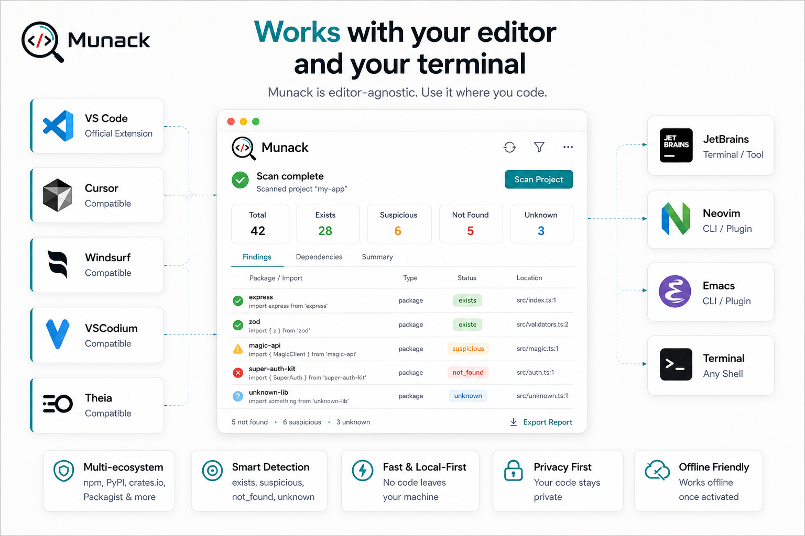

# Munack

Reality check for AI-generated code.

Munack is a deterministic, local-first scanner that looks for potentially hallucinated packages, SDKs, imports, frameworks, and dependencies by comparing what it finds in a project against public package registries.



## What v1 does

- Scans dependency manifests and lockfiles for JavaScript, Python, Rust, and PHP ecosystems
- Scans import statements in JS, TS, Python, and Rust where the mapping is practical
- Checks existence against `npm`, `PyPI`, `crates.io`, and `Packagist`
- Classifies findings as `exists`, `not_found`, `suspicious`, or `unknown`
- Supports project config via `.munackrc.json` or `package.json#munack`
- Supports `markdown`, `json`, and `sarif` output formats for CLI and CI usage
- Works fully locally except for public registry existence checks
- Never uploads source code or requires any AI/cloud model

## Monorepo layout

- `packages/munack-core` - shared discovery, registry, licensing, caching, and report engine
- `packages/munack-cli` - CLI for terminals and editor-integrated terminals
- `packages/munack-vscode` - VS Code-compatible extension for VS Code family editors
- `docs/` - release and upload documentation
- `services/munack-license-api` - optional standalone PHP backend for Gumroad verify/ping on shared hosting
- `samples/` - sample projects used for smoke testing

## Supported inputs

- `package.json`
- `package-lock.json`
- `pnpm-lock.yaml`
- `yarn.lock`
- `requirements.txt`
- `pyproject.toml`
- `Pipfile`
- `Cargo.toml`
- `composer.json`
- `import` / `require` / `from` / `use` statements in JS, TS, Python, and Rust

## CLI

Build the workspace:

```powershell
npm install
npm run build
npm run admin
```

Run the CLI directly from the repo:

```powershell
node .\packages\munack-cli\dist\index.js scan .
node .\packages\munack-cli\dist\index.js scan .\samples\hallucinated-mixed
node .\packages\munack-cli\dist\index.js scan . --format sarif --fail-on not_found,suspicious
node .\packages\munack-cli\dist\index.js check react --registry npm
node .\packages\munack-cli\dist\index.js doctor
node .\packages\munack-cli\dist\index.js activate YOUR-GUMROAD-LICENSE-KEY
node .\packages\munack-cli\dist\index.js license status
node .\packages\munack-cli\dist\index.js license deactivate
```

Optional project config:

```json
{
  "includeCodeImports": true,
  "ignoreDirs": [".cache", "generated"],
  "registryTimeoutMs": 8000,
  "registryConcurrency": 8
}
```

## Licensing

- Free: `5` scans per month
- Pro: `$9/month`, unlimited scans, export report
- Team: `$19/month`, same behavior as Pro in v1 with plan metadata prepared

Munack reads:

- `MUNACK_GUMROAD_PRODUCT_ID`
- `MUNACK_LICENSE_KEY`
- `MUNACK_LICENSE_API_URL`
- `MUNACK_LICENSE_API_TOKEN`
- `MUNACK_HOME`
- `MUNACK_LICENSE_CACHE_TTL_HOURS`
- `MUNACK_REGISTRY_TIMEOUT_MS`

License status and usage are cached locally under the user config directory at `~/.munack/state.json`.
If `MUNACK_LICENSE_API_URL` is set, Munack can verify against a dedicated Munack license backend instead of calling Gumroad directly.
The repo also includes a deployable PHP backend in `services/munack-license-api`.

Current default Gumroad product ID embedded in Munack:

- `qHus0ABlM9o8mhVLxqjVoA==`

## VS Code extension

The extension contributes these commands:

- `Munack: Scan Project`
- `Munack: Check Current File`
- `Munack: Activate License`
- `Munack: License Status`

Build the extension and package a VSIX:

```powershell
npm run test:extension
npm run package:vsix
```

Generated file:

- `packages/munack-vscode/dist/munack-0.1.4.vsix`

Theia helper launcher:

```powershell
.\scripts\launch-theia-with-munack.ps1
```

## Local admin panel

Run the local admin dashboard:

```powershell
npm run admin
```

Then open:

- `http://127.0.0.1:8791`

If that port is already used, start it on another port:

```powershell
$env:MUNACK_ADMIN_PORT="8791"
npm run admin
```

Optional manual overrides:

- copy `admin/overrides.json.example` to `admin/overrides.json`
- fill in values such as Marketplace installs or Gumroad funnel numbers that public product pages do not expose

## Compatibility targets

CLI target users:

- JetBrains
- Visual Studio
- Sublime Text
- Zed
- Neovim
- Emacs
- Terminal users

VS Code-compatible target editors:

- VS Code
- Cursor
- Windsurf
- VSCodium
- Theia

See [docs/VSCODE_MARKETPLACE_UPLOAD.md](C:/Users/balka/Desktop/Munack/docs/VSCODE_MARKETPLACE_UPLOAD.md) and [REPORT.md](C:/Users/balka/Desktop/Munack/REPORT.md) for packaging and local test status.
For Gumroad webhook and activation architecture, see [docs/GUMROAD_ARCHITECTURE.md](C:/Users/balka/Desktop/Munack/docs/GUMROAD_ARCHITECTURE.md).
For shared-hosting deployment notes, see [docs/HOSTINGER_DEPLOY.md](C:/Users/balka/Desktop/Munack/docs/HOSTINGER_DEPLOY.md).
