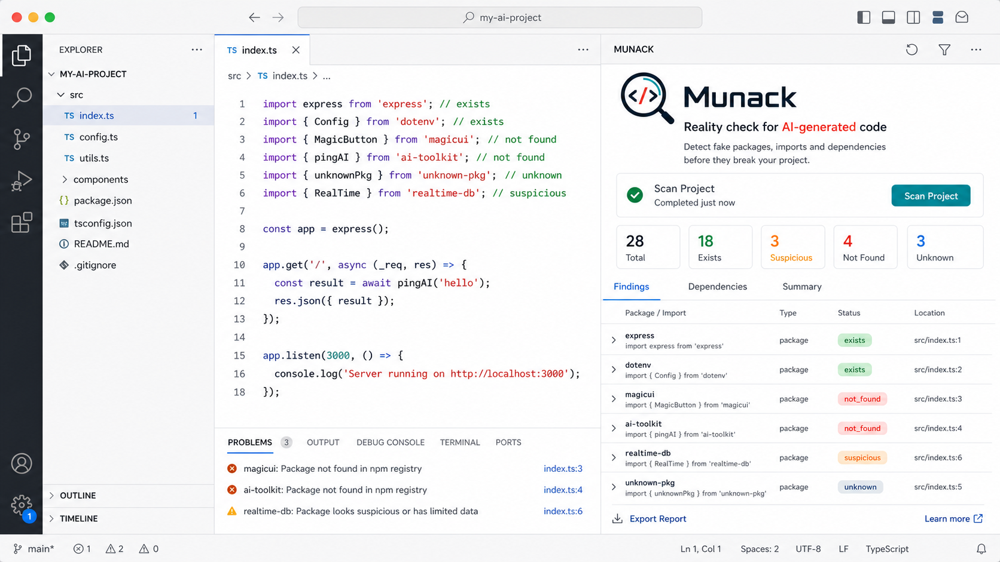
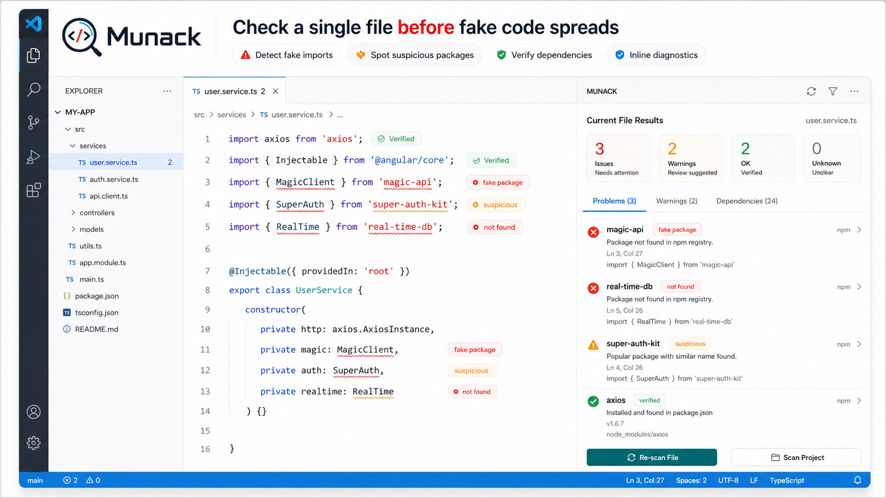
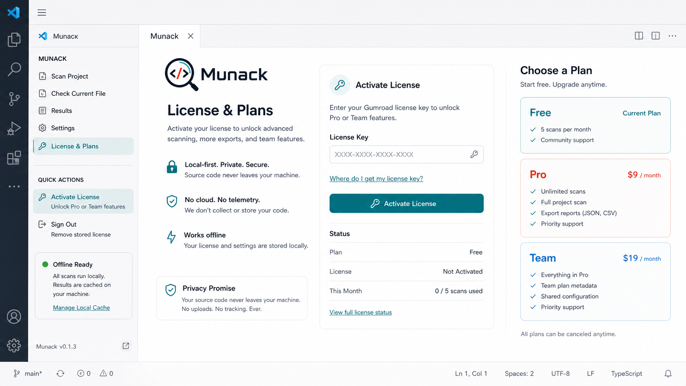

# Munack

Munack is a local-first extension for detecting fake packages, fake imports, fake APIs, fake frameworks, fake dependencies, fake SDK references, slopsquatting risk, and hallucinated package names in AI-generated code.

It helps you verify whether a package, import, or dependency actually exists before bad generated code spreads through your project, your pull request, or your release pipeline.



## Why developers install Munack

- catch fake packages suggested by AI tools
- catch slopsquatting-style package mistakes before install
- catch fake imports before they break builds
- verify dependencies against public registries
- review suspicious package names quickly
- keep source code local while still checking public registries
- work across VS Code, Cursor, Windsurf, VSCodium, Theia, and terminal-heavy workflows

## Fast proof

If you want to evaluate Munack quickly:

- install the extension from VS Marketplace or Open VSX
- run `Munack: Scan Project`
- compare the results with the public benchmark samples in the repository

For a CLI-first path, use `munack-cli` and the public quickstart guide in the repository.

## Why teams evaluate Munack

- the product pitch is easy to understand in one sentence
- the extension is backed by a CLI and shared core engine
- the problem is tied to AI-generated code quality and supply-chain risk
- the repository includes reproducible benchmark samples
- the scanner supports SARIF, CI gating, and marketplace-ready distribution

## What Munack detects

- fake package
- fake import
- fake API
- fake framework
- fake dependency
- fake SDK
- hallucinated package

Munack classifies findings as:

- `exists`
- `not_found`
- `suspicious`
- `unknown`

## Overview

### Scan a whole project

Munack scans dependency manifests, lockfiles, and code imports to give AI-generated code a reality check before it wastes your time.


### Check the current file

Review a single file when you want quick feedback on imports, package names, and suspicious dependencies without leaving the editor.



### Activate Free, Pro, or Team

Munack supports a free plan, a Pro plan, and a Team-ready plan model for developers who want unlimited scans and richer export workflows.



### Works with your editor and your terminal

Use Munack as a VS Code-compatible extension or as a CLI-driven workflow in the editor and terminal setup you already use.


## Before and after

Before Munack:

- AI-generated code introduces package names that look valid but do not exist
- reviewers waste time checking whether imports are real
- suspicious dependency names can slip into CI or release branches

After Munack:

- suspicious package names are surfaced immediately
- missing registry-backed packages stand out before merge
- local-first scans give a fast dependency reality check without uploading code

## Works With

VS Code-compatible editors:

- VS Code
- Cursor
- Windsurf
- VSCodium
- Theia

CLI-oriented editor workflows:

- JetBrains terminal and external tools
- Visual Studio terminal and external tools
- Sublime Text build systems
- Zed tasks
- Neovim commands
- Emacs shell and compilation flows
- plain terminal workflows

## Target Platforms

Munack is built as a JavaScript extension package and is intended for:

- Windows x64
- Windows arm64
- macOS Intel
- macOS Apple Silicon
- Linux x64
- Linux arm64
- Linux armhf
- Alpine x64
- Alpine arm64

## Commands

- `Munack: Scan Project`
- `Munack: Check Current File`
- `Munack: Activate License`
- `Munack: License Status`

## Public registry coverage

Munack checks package existence against:

- npm
- PyPI
- crates.io
- Packagist

## Why this matters now

AI coding tools still invent package names that do not exist, and attackers can register those names on public registries as part of slopsquatting-style supply-chain attacks.

Munack gives teams a fast local-first reality check before those dependencies reach CI, pull requests, or production.

## CI and release workflows

- use the CLI in local validation or CI
- export `json` or `sarif`
- fail builds on `not_found` or `suspicious`

Example:

```powershell
node .\packages\munack-cli\dist\index.js scan . --format sarif --output .\reports\munack.sarif
node .\packages\munack-cli\dist\index.js scan . --fail-on not_found,suspicious
```

## Benchmark-ready samples

The repository includes adversarial benchmark samples that mix real and hallucinated package references across supported ecosystems. These samples make Munack easier to evaluate, demo, and regression-test.

## Privacy and local-first behavior

- your source code is not uploaded
- no AI model is required
- no cloud code analysis is required
- only public package names are checked against public registries
- license state and usage can be cached locally for graceful offline behavior

## Who Munack is for

- developers reviewing AI-generated code
- teams using Copilot, Cursor, Claude Code, ChatGPT, and similar tools
- maintainers who want a quick dependency reality check
- CI and local workflows that need a package existence scanner

## Search-friendly summary

If you are looking for a VS Code extension, Cursor extension, Windsurf extension, VSCodium extension, or Theia-compatible tool to detect fake packages, hallucinated imports, invented dependencies, and suspicious AI-generated code suggestions, Munack is built for that workflow.
